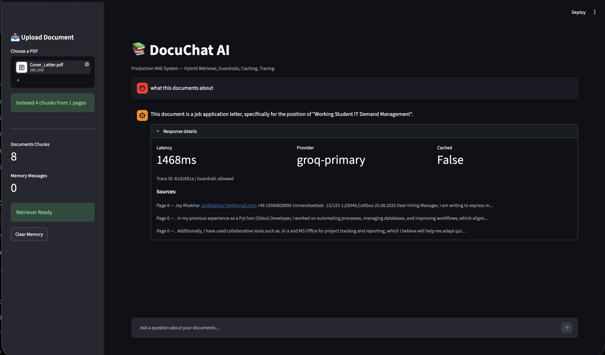

# DocuChat AI — Production RAG System

A production-grade Retrieval-Augmented Generation (RAG) system for document Q&A. Built with hybrid retrieval, input guardrails, Redis caching, LLM fallback, Langfuse tracing, and RAGAS evaluation.



---

## What makes this production-grade

Most RAG tutorials stop at FAISS + LangChain + a basic prompt. This system goes further:

- **Hybrid retrieval** — BM25 keyword search combined with FAISS dense vector search using Reciprocal Rank Fusion. Improves recall on ambiguous queries where pure vector search fails.
- **Input guardrails** — Detects jailbreak attempts, PII (emails, phone numbers, SSNs), and sensitive topics before the query reaches the LLM.
- **Output validation** — Checks if the response is grounded in retrieved documents. Flags low-confidence answers.
- **Redis caching** — Repeated queries return cached responses in under 10ms instead of making a full LLM call.
- **LLM fallback** — If the primary Groq model fails, automatically falls back to the backup model without the user noticing.
- **Langfuse tracing** — Every query traces retrieval quality, latency, provider, and token usage. Full pipeline observability.
- **Sliding window memory** — Conversation history kept to last 6 messages to avoid context bloat.
- **RAGAS evaluation** — Measures faithfulness, answer relevancy, context precision, and context recall on a golden test set.

---

## Architecture

```
PDF Upload
    ↓
Document Ingestion Pipeline
(PDF loading → text cleaning → semantic chunking)
    ↓
Input Guardrails
(jailbreak detection → PII filtering → sensitive topics)
    ↓
Hybrid Retriever
(BM25 keyword search + FAISS dense vector → RRF combination)
    ↓
LLM Gateway
(Redis cache check → Groq primary → fallback model)
    ↓
Output Validation
(grounding check → hallucination detection)
    ↓
Langfuse Tracer
(latency → provider → retrieval quality → tokens)
    ↓
Response + Sources
```

---

## Tech Stack

| Layer | Technology |
|---|---|
| LLM Framework | LangChain |
| LLM Provider | Groq (Llama 3.3 70B) |
| Vector Search | FAISS |
| Keyword Search | BM25 (rank-bm25) |
| Embeddings | Sentence Transformers (all-MiniLM-L6-v2) |
| Caching | Redis |
| Tracing | Langfuse |
| Evaluation | RAGAS |
| API | FastAPI |
| UI | Streamlit |
| Containerisation | Docker, Docker Compose |

---

## Getting Started

**1. Clone and setup**

```bash
git clone https://github.com/Jk180603/DocuChat-AI
cd DocuChat-AI
python -m venv venv
source venv/bin/activate
pip install -r requirements.txt
```

**2. Set environment variables**

```bash
cp .env.example .env
# Add your keys:
# GROQ_API_KEY — free at console.groq.com
# LANGFUSE_PUBLIC_KEY — free at cloud.langfuse.com
# LANGFUSE_SECRET_KEY — free at cloud.langfuse.com
```

**3. Start Redis (required for caching)**

```bash
docker run -d -p 6379:6379 redis:7-alpine
```

**4. Start the API**

```bash
uvicorn app.main:app --reload
```

**5. Start the dashboard**

```bash
streamlit run app/dashboard.py
```

Open `http://localhost:8501`, upload a PDF, and start asking questions.

**6. Run with Docker (everything at once)**

```bash
docker-compose up --build
```

API: `http://localhost:8000` · Dashboard: `http://localhost:8501`

---

## API Endpoints

| Endpoint | Method | Description |
|---|---|---|
| `/` | GET | System info and feature list |
| `/upload` | POST | Upload and index a PDF |
| `/query` | POST | Ask a question about your documents |
| `/memory` | DELETE | Clear conversation history |
| `/health` | GET | Health check |
| `/stats` | GET | Documents loaded, memory size, retriever status |

---

## Run RAGAS Evaluation

```bash
python src/evaluation/evaluate.py
```

Runs 5 golden questions through the full pipeline and outputs faithfulness, answer relevancy, context precision, and context recall scores.

---

## Project Structure

```
DocuChat-AI/
├── src/
│   ├── ingestion/pipeline.py       # PDF loading and chunking
│   ├── retrieval/retriever.py      # Hybrid BM25 + FAISS
│   ├── guardrails/guards.py        # Input and output validation
│   ├── gateway/llm_gateway.py      # Groq + fallback + Redis cache
│   ├── gateway/tracer.py           # Langfuse tracing
│   ├── memory/memory.py            # Sliding window memory
│   └── evaluation/evaluate.py      # RAGAS evaluation
├── app/
│   ├── main.py                     # FastAPI application
│   └── dashboard.py                # Streamlit UI
├── docker-compose.yml
├── Dockerfile
├── requirements.txt
└── .env.example
```

---

Built by [Jay Khakhar](https://github.com/Jk180603) · MSc AI @ BTU Cottbus
